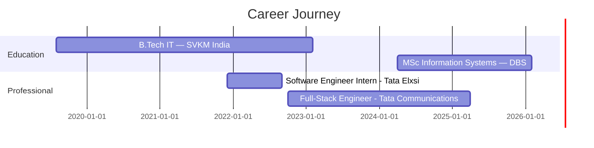

<div align="center">
  
</div>

<div align="center">

[](https://git.io/typing-svg)

</div>

<br>

<div align="center">

[](https://visitcount.itsvg.in)

</div>


<br>

<div align="center">

```js
const yogesh = {
    location: "Dublin, Ireland 🇮🇪",
    role: "Full-Stack Software Engineer",
    experience: "2.5 years commercial",
    stack: ["TypeScript", "Node.js", "React", "Next.js", "PostgreSQL", "AWS"],
    impact: {
        efficiency:   "60% reduction in manual operational effort",
        reliability:  "41% improvement in system reliability",
        engagement:   "30% increase in user engagement",
        performance:  "35% faster API response times"
    },
    education:    "MSc Information Systems — Dublin Business School (Feb 2026)",
    status:       "Stamp 1G ✅ — Available Immediately",
    openTo:       "Full-Stack, Backend & Software Engineering roles in Ireland"
};
console.log("Shipping clean code and scalable systems 🚀");
```

</div>

<br>


<br>

## 🚀 Featured Projects

<table>
<tr>
<td width="50%" valign="top">

### 🤖 CAReader-AI
<a href="https://github.com/imyogeshgaikwad/CAReader-Ai">
  
</a>

Full-stack AI-powered document reader & chatbot

```yaml
Backend:    TypeScript + Node.js
Frontend:   React + Next.js
Auth:       JWT Authentication
AI:         AI-powered chatbot
APIs:       RESTful architecture
Impact:     50% reduction in user search time
```

[📂 GitHub Repo](https://github.com/imyogeshgaikwad/CAReader-Ai)

---

### 🔥 Detecting-Humans-in-Fire
<a href="https://github.com/imyogeshgaikwad/Detecting-Humans-In-Fire">
  
</a>

Real-time fire emergency human detection system

```yaml
Backend:    Python + FastAPI
ML:         TensorFlow image recognition
API:        Real-time REST predictions
Purpose:    Fire emergency detection
Type:       Computer Vision
```

[📂 GitHub Repo](https://github.com/imyogeshgaikwad/Detecting-Humans-In-Fire)

</td>
<td width="50%" valign="top">

### 📦 Inventory Management System
<a href="https://github.com/imyogeshgaikwad/yogesh-inventory-backend">
  
</a>

End-to-end inventory management platform

```yaml
Backend:    Node.js + Express
Frontend:   React.js
Database:   PostgreSQL / MongoDB
Auth:       JWT + RBAC
Pattern:    MVC Architecture
APIs:       Full RESTful CRUD
```

[📂 Backend](https://github.com/imyogeshgaikwad/yogesh-inventory-backend) • [📂 Frontend](https://github.com/imyogeshgaikwad/yogesh-inventory-frontend)

---

### 🍔 Food Delivery App
<a href="https://github.com/imyogeshgaikwad/food-delivery">
  
</a>

Swiggy-inspired full-featured food ordering platform

```yaml
Stack:      React.js + Node.js
Features:   Cart, ordering, menu UI
Inspired:   Swiggy clone architecture
Type:       Full-stack web app
```

[📂 Food Delivery](https://github.com/imyogeshgaikwad/food-delivery) • [📂 Swiggy Clone](https://github.com/imyogeshgaikwad/Swiggy)

</td>
</tr>
</table>

<br>


<br>

## 💼 Professional Impact

<div align="center">

| ⚡ Efficiency | 🎯 Reliability | 📈 Engagement | 🚀 Performance |
|:------------:|:--------------:|:-------------:|:--------------:|
| **60% less effort** | **41% improved** | **30% increase** | **35% faster** |
| Automated pipelines | React IoT dashboard | Cloud-based APIs | Middleware optimisation |
| Sheets → Firebase | 99% uptime APIs | Google Chat responses | High-traffic handling |

</div>

```diff
@@ Commercial Achievements @ Tata Communications & Tata Elxsi @@

+ Chatbot Efficiency:   50% improvement via TypeScript + Dialogflow integration
+ Data Automation:      60% manual effort eliminated with Cloud Functions pipelines
+ User Engagement:      30% increase through rich Google Chat API responses
+ Response Times:       15% faster customer support via Agent Assist integration
+ API Performance:      35% reduction in latency under high-traffic conditions
+ System Reliability:   41% MTTR improvement with React.js IoT production dashboard
+ Security:             RBAC implementation strengthening access compliance
+ Uptime:               99% maintained on RESTful authentication APIs
```

<br>


<br>

## 🛠️ Tech Stack

<div align="center">

### Core Languages


### Backend & APIs


### Frontend


### Databases


### AI & Automation


### Cloud & DevOps


### Tools & Workflow


</div>

<br>


<br>

## 📊 GitHub Analytics

<div align="center">
  
</div>

<div align="center">
  
  
</div>

<br>


<br>

## 💼 Experience Timeline

<div align="center">



</div>

<details>
<summary><b>🏢 Full-Stack Software Engineer @ Tata Communications (Oct 2022 – Apr 2025)</b></summary>
<br>

**Global Technology & Digital Infrastructure Leader**

- 🤖 Built **TypeScript + Node.js** backend with custom **Dialogflow** chatbot modules — **50% boost** in response efficiency
- ⚙️ Automated **Google Sheets → Firebase** pipelines via **Cloud Functions** — eliminated **60% of manual data entry**
- 📡 Developed **cloud-based APIs** delivering rich responses in **Google Chat** — **30% increase** in user engagement
- 🎙️ Integrated **Agent Assist** for voice virtual agents — **15% faster** customer response times
- 📋 Delivered features across **Agile Scrum** sprints with consistent on-time delivery via **Jira**

</details>

<details>
<summary><b>💻 Software Engineer Intern @ Tata Elxsi (Dec 2021 – Sep 2022)</b></summary>
<br>

**Global Design & Technology Services Company**

- 🔗 Designed and implemented **RESTful APIs** for auth, feedback & issue reporting — **99% uptime** maintained
- ⚡ Optimised **middleware layer** — **35% reduction** in API response times under high-traffic conditions
- 🔐 Implemented **Role-Based Access Control (RBAC)** — strengthening security and compliance
- 📊 Built **React.js IoT dashboard** for Tata Motors — **41% improvement** in mean time to resolve production issues

</details>

<br>


<br>

## 🎓 Education & Status

<table>
<tr>
<td width="50%">

### 🏛️ Dublin Business School 🇮🇪
**MSc in Information Systems with Computing**
*Apr 2024 – Feb 2026 (Graduating this month!)*

**Focus Areas:**
- Software Engineering & Architecture
- Information Systems Design
- Cloud Computing & Databases

</td>
<td width="50%">

### 🏛️ SVKM Institute of Technology 🇮🇳
**B.Tech in Information Technology**
*Aug 2019 – Feb 2023*

**Focus Areas:**
- Full-Stack Development
- Data Structures & Algorithms
- Software Engineering

</td>
</tr>
</table>

<div align="center">

### 🟢 Work Authorization


</div>

<br>


<br>

## 🧑‍💻 About Me

- 🔭 Currently working on **CAReader-AI** — building smarter document interaction with AI
- 🌱 Currently learning **System Design at Scale**, **Cloud Architecture (AWS)**, **AI integrations in production**
- 🤝 Open to collaborating on **open-source tools, SaaS products & developer utilities**
- 💬 Ask me about **TypeScript, Node.js APIs, React, backend architecture, AWS**
- 📫 Reach me at **imyogeshgaikwad@gmail.com** | 📞 **+353 874 925777**
- 📍 Based in **Dublin, Ireland** — available immediately (Stamp 1G)
- ⚡ Fun fact: **1.01³⁶⁵ ≫ 1.00³⁶⁵** — consistent 1% improvements compound into extraordinary results 🐢

---

## 🤝 Connect With Me

<div align="center">

[](https://www.linkedin.com/in/yogesh-gaikwad-jss/)
[](https://github.com/imyogeshgaikwad)
[](mailto:imyogeshgaikwad@gmail.com)

</div>

<div align="center">

### 💭 Open To

Full-Stack Engineering • Backend Development • Software Engineering Roles
**Actively seeking opportunities in Ireland 🇮🇪**

</div>

<br>

<div align="center">
  
</div>

<div align="center">


**⭐ If you find my projects useful, consider starring them!**

</div>
