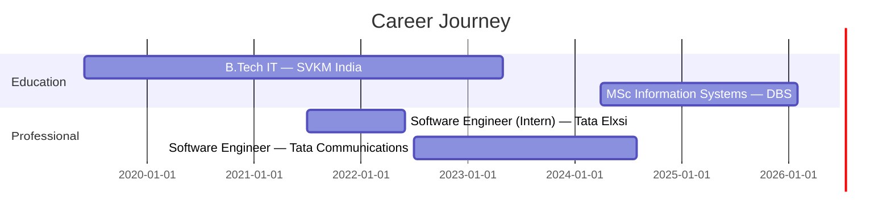

<div align="center">
  
</div>

<div align="center">

[](https://git.io/typing-svg)

</div>

<br>

<div align="center">

[](https://visitcount.itsvg.in)

</div>


<br>

<div align="center">

```js
const yogesh = {
    location:    "Dublin, Ireland 🇮🇪",
    role:        "Software Engineer | Distributed Systems & Backend Infrastructure",
    experience:  "3 years commercial (Tata Communications + Tata Elxsi)",
    stack:       ["TypeScript", "Node.js", "Python", "PostgreSQL", "Redis", "AWS", "Docker", "Kubernetes"],
    impact: {
        users:        "50,000+ enterprise users supported across production systems",
        uptime:       "99.9% SLA maintained across Fortune 500 clients",
        latency:      "45% reduction in system latency",
        deployments:  "83% faster deployment cycles via CI/CD",
        throughput:   "60% throughput increase via event-driven architecture",
        infra_cost:   "25% infrastructure cost savings (~$30K annually)"
    },
    education:   "MSc Information Systems — Dublin Business School (Feb 2026)",
    status:      "Stamp 1G ✅ — Available Immediately",
    openTo:      "Backend, Distributed Systems & Software Engineering roles in Ireland"
};
console.log("Building fault-tolerant systems at scale 🚀");
```

</div>

<br>


<br>

## 🚀 Featured Projects

<table>
<tr>
<td width="50%" valign="top">

### 🤖 CAReader-AI
<a href="https://github.com/imyogeshgaikwad/CAReader-Ai">
  
</a>

AI-powered car dealership management platform

```yaml
Backend:    Node.js + JavaScript
AI Layer:   OpenAI API integration
APIs:       RESTful CRUD (vehicles, clients, transactions)
Impact:     Automates client comms & data entry end-to-end
```

[📂 GitHub Repo](https://github.com/imyogeshgaikwad/CAReader-Ai)

---

### 🔥 Detecting-Humans-in-Fire
<a href="https://github.com/imyogeshgaikwad/Detecting-Humans-In-Fire">
  
</a>

Dual-model computer vision system for fire emergency detection

```yaml
Model 1:    EfficientNetB0 — 90.9% fire detection accuracy
Model 2:    YOLOv8 — 90.8% human detection accuracy
Output:     4-state situational risk assessment
Deploy:     Flask web app, fully in-memory processing
```

[📂 GitHub Repo](https://github.com/imyogeshgaikwad/Detecting-Humans-In-Fire)

</td>
<td width="50%" valign="top">

### 📦 Inventory Management System
<a href="https://github.com/imyogeshgaikwad/yogesh-inventory-backend">
  
</a>

End-to-end inventory management platform

```yaml
Backend:    Node.js + Express
Frontend:   React.js
Database:   PostgreSQL / MongoDB
Auth:       JWT + RBAC
Pattern:    MVC Architecture
APIs:       Full RESTful CRUD
```

[📂 Backend](https://github.com/imyogeshgaikwad/yogesh-inventory-backend) • [📂 Frontend](https://github.com/imyogeshgaikwad/yogesh-inventory-frontend)

---

### 🍔 Food Delivery App
<a href="https://github.com/imyogeshgaikwad/food-delivery">
  
</a>

Swiggy-inspired full-featured food ordering platform

```yaml
Stack:      React.js + Node.js
Features:   Cart, ordering, menu UI
Inspired:   Swiggy clone architecture
Type:       Full-stack web app
```

[📂 Food Delivery](https://github.com/imyogeshgaikwad/food-delivery) • [📂 Swiggy Clone](https://github.com/imyogeshgaikwad/Swiggy)

</td>
</tr>
</table>

<br>


<br>

## 💼 Production Impact

<div align="center">

| 🧑‍💻 Scale | ⚡ Latency | 🚀 Deployments | 💰 Cost |
|:---------:|:---------:|:--------------:|:-------:|
| **50,000+ users** | **45% reduction** | **83% faster** | **25% savings** |
| Enterprise production systems | 500ms → 300ms APIs | 2 hrs → 20 mins | ~$30K/year saved |

</div>

```diff
@@ Key Achievements @ Tata Communications & Tata Elxsi @@

+ API Scale:         25,000+ daily requests handled across telecom infrastructure
+ DB Optimisation:  PostgreSQL query latency cut from 850ms → 300ms (65%) across 10M+ records
+ Throughput:       60% improvement via event-driven job processing & message queues
+ Uptime:           99.9% SLA maintained for Fortune 500 enterprise clients
+ CI/CD:            Deployment cycles cut from 2 hours to 20 minutes (83% faster)
+ Observability:    35% MTTR reduction via CloudWatch metrics & centralised logging
+ Microservices:    Decomposed monolith into 6 independent services — 30% fewer regressions
+ Real-time:        Redis Pub/Sub + WebSockets supporting 5,000+ concurrent connections
+ Infra Cost:       25% reduction (~$30K annually) through container right-sizing
```

<br>


<br>

## 🛠️ Tech Stack

<div align="center">

### Core Languages


### Backend Systems


### Databases


### Cloud & DevOps


### AI & ML


### Frontend


</div>

<br>


<br>

## 📊 GitHub Analytics

<div align="center">
  
</div>

<div align="center">
  
  
</div>

<br>


<br>

## 💼 Experience Timeline

<div align="center">



</div>

<details>
<summary><b>🏢 Software Engineer @ Tata Communications (Jul 2022 – Aug 2024)</b></summary>
<br>

**Global Telecom & Digital Infrastructure Leader**

- ⚙️ Designed and deployed scalable REST APIs handling **25,000+ daily requests**, improving average response time by **40%** (500ms → 300ms) via Redis caching & query optimisation
- 🔄 Architected **event-driven background job processing** using message queues & worker services, boosting system throughput by **60%** for 50,000+ enterprise users
- 🐳 Implemented **horizontal scaling** with Docker + AWS EC2 auto-scaling groups, achieving **99.9% uptime SLA** for Fortune 500 clients
- 🗄️ Optimised **PostgreSQL queries** across 10M+ records — reduced critical query latency from 850ms → 300ms (**65% reduction**)
- 🚀 Built end-to-end **CI/CD pipeline** with GitHub Actions — deployment cycles from 2 hours to 20 minutes (**83% faster**)
- 📊 Instrumented production with **CloudWatch** metrics & centralised logging — **35% MTTR reduction**

</details>

<details>
<summary><b>💻 Software Engineer (Internship) @ Tata Elxsi (Jul 2021 – Jun 2022)</b></summary>
<br>

**Global Design & Technology Services Company**

- 🧩 Engineered **modular microservices architecture** supporting 15,000+ active users with JWT auth, adaptive rate limiting & fault isolation
- 📡 Built **real-time notification service** using Redis Pub/Sub + WebSockets — 5,000+ concurrent connections at sub-150ms latency
- 💰 Reduced **infrastructure costs by 25%** (~$30K annually) through container right-sizing and intelligent resource allocation
- 🔧 Led **monolith decomposition** into 6 independent service modules — reduced regression issues by 30%, hotfixes from 8/month to under 3

</details>

<br>


<br>

## 🎓 Education & Status

<table>
<tr>
<td width="50%">

### 🏛️ Dublin Business School 🇮🇪
**MSc in Information Systems with Computing**
*Apr 2024 – Feb 2026 — First Class Honours*

**Core Modules:**
- Distributed Systems
- Cloud Architecture & Scalable Computing
- Database Engineering
- Software Design Patterns

</td>
<td width="50%">

### 🏛️ SVKM Institute of Technology 🇮🇳
**B.Tech in Information Technology**
*Jun 2019 – May 2023 — First Class Honours*

**Core Modules:**
- Data Structures & Algorithms
- Operating Systems & Computer Networks
- Database Management Systems
- Object-Oriented Programming

</td>
</tr>
</table>

<div align="center">

### 🟢 Work Authorization


</div>

<br>


<br>

## 🧑‍💻 About Me

- 🔭 Currently building **Detecting-Humans-in-Fire** — MSc applied research using dual computer vision models for fire safety
- 🌱 Deep-diving into **Distributed Systems Design**, **AWS cloud-native infrastructure**, and **production reliability engineering**
- 🤝 Open to collaborating on **open-source backend tools, scalable APIs & developer utilities**
- 💬 Ask me about **Node.js, TypeScript, distributed systems, PostgreSQL optimisation, AWS, Docker**
- 📫 Reach me at **imyogeshgaikwad@gmail.com** | 📞 **+353 87 492 5777**
- 📍 Based in **Dublin, Ireland** — available immediately (Stamp 1G)
- ⚡ Fun fact: **1.01³⁶⁵ ≫ 1.00³⁶⁵** — consistent 1% improvements compound into extraordinary results 🐢

---

## 🤝 Connect With Me

<div align="center">

[](https://www.linkedin.com/in/yogesh-gaikwad-jss/)
[](https://github.com/imyogeshgaikwad)
[](mailto:imyogeshgaikwad@gmail.com)

</div>

<div align="center">

### 💭 Open To

Backend Engineering • Distributed Systems • Software Engineering Roles
**Actively seeking opportunities in Ireland 🇮🇪**

</div>

<br>

<div align="center">
  
</div>

<div align="center">


**⭐ If you find my projects useful, consider starring them!**

</div>
